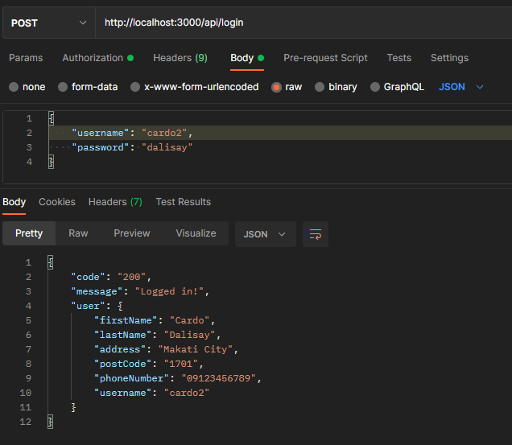
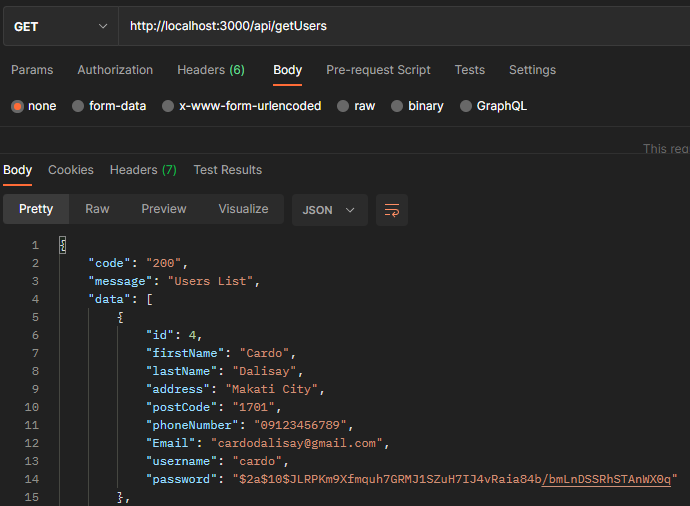
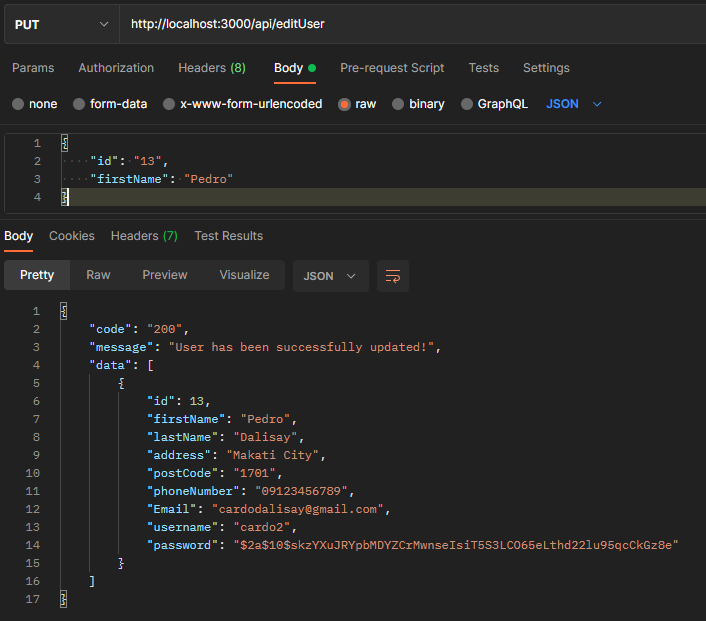
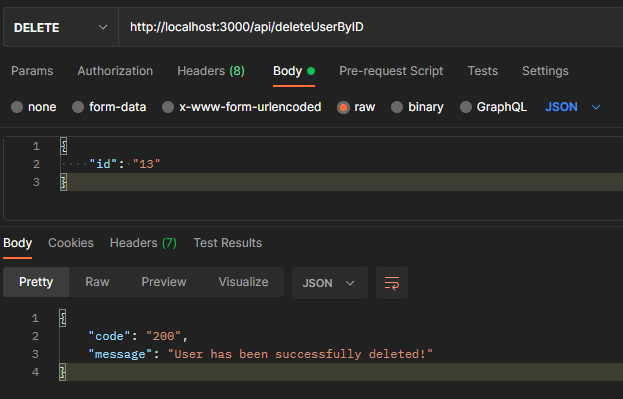
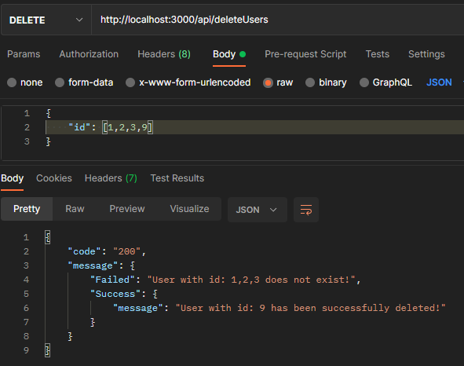

# API Backend Exam (Set 2)

To run this application
- make sure that you have mysql running
- nodejs installed
- npm installed

## Installation Guide
1. Open your ssh terminal and run these commands
   > `git clone https://github.com/natesparas/yondu_set2.git`

   > `cd yondu_set2`

   > `npm i`

2. Create database
   > `db-migrate db:create db_user`

3. Create table
   > `db-migrate create users`

4. Migrate table fields
   > `db-migrate up`

5. Run application
   > `npm start`

## API endpoints user guide

### Table Structure
   > |Field Name      |Data type                      |Description                  |
   > |----------------|-------------------------------|-----------------------------|
   > |id              |`INT(11)`                      |`PK - NN - AI`               |
   > |firstName       |`VARCHAR(100)`                 |`Default: NULL`              |
   > |lastName        |`VARCHAR(100)`                 |`Default: NULL`              |
   > |address         |`VARCHAR(100)`                 |`Default: NULL`              |
   > |postCode        |`VARCHAR(100)`                 |`Default: NULL`              |
   > |phoneNumber     |`VARCHAR(50)`                  |`Default: NULL`              |
   > |email           |`VARCHAR(100)`                 |`Default: NULL`              |
   > |username        |`VARCHAR(100)`                 |`NN`                         |
   > |password        |`VARCHAR(100)`                 |`NN`                         |

### To test the API, we will be using postman. But you can use your preferred API Platform

1. First, you need to add new user and get the token result. We will be using JWTWebToken to authenticate login

   
> **addUser Endpoint : Sample request**

        {
                "firstName" : "Cardo",
                "lastName" : "Dalisay",
                "address" : "Makati City",
                "postCode" : "1701",
                "phoneNumber" : "09123456789",
                "email" : "cardodalisay@gmail.com",
                "username" : "cardo3",
                "password" : "dalisay"
        }

2. Paste token in the **Autherization > Type: Bearer Token** and follow the image below

   
> **login Endpoint : Sample request**

        {
                "username": "cardo2",
                "password": "dalisay"
        }
        
3. Get Users List
   
   

4. Edit User. **id is required**. Get id from the **getUsers** endpoint.
   
   
> **editUser Endpoint : Sample request**

        {
                "id": "13",
                "firstName": "Pedro"
        }

5. Delete User by ID. **id is required**. Get id from the **getUsers** endpoint.

   
> **deleteUserByID Endpoint : Sample request**

        {
                "id": "13"
        }

6. Delete Multiple User. **id is required and must be in array**. Get id from the **getUsers** endpoint.

   
> **deleteUsers Endpoint : Sample request**
> 
        {
                "id": [1,2,3,9]
        }